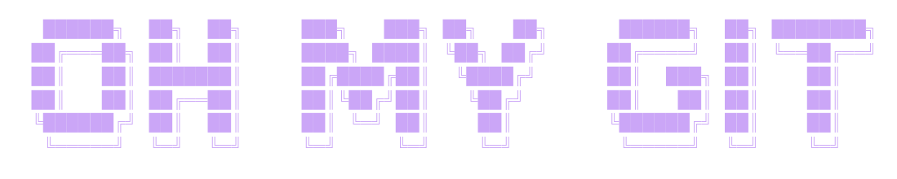

---

> A supercharged git repository manager.

Oh-My-Git is a command-line tool that helps you manage all your local git repositories from a single place. Clone, search, tag, inspect, update, and navigate your repos without remembering where they live on disk.

## Installation

```bash
git clone https://github.com/iRyann/oh-my-git.git
cd oh-my-git
pip install -e .
```

This installs the `omg` command and sets up shell autocompletion.

### Set up Autocompletion

Source the autocompletion script in your shell configuration:

**Bash:**
```bash
echo 'source /path/to/oh-my-git/src/autocomplete.sh' >> ~/.bashrc
```

You'll get context-aware completion for module names and repository aliases when typing `omg <TAB>`.

## Usage

```
omg <command> [options]
```

Run `omg --help` to see all available commands, or `omg help <command>` for detailed help on a specific module.


## TUI Mode

```bash
omg tui
```

Launches an interactive terminal user interface powered by `curses`:

- **Repository list** — browse all registered repositories with arrow keys
- **`/`** — filter repositories by name (type to search)
- **`:`** — filter repositories by tags (space-separated for multiple tags)
- **Enter** — view detailed repository information including commit sync status (ahead/behind origin)
- **Action menu** — from the detail view, select an action: `run`, `edit`, `pull`, `origin`, `rename`, `tag`, `script`, `readme`, `rm`
- **Backspace** — return to the repository list
- **`q`** — quit

The TUI exits after executing a repository command.

## Help

```bash
omg help              # list all commands
omg help <command>    # detailed help for a specific command
```

## Configuration

Oh-My-Git stores its data in `~/.omg/`:

| File | Description |
|------|-------------|
| `~/.omg/repositories.json` | Repository registry (aliases, paths, origins, tags, icons) |
| `~/.omg/config.json` | Configuration (preferred shell, editor, web browser) |
| `~/.omg/scripts.json` | Global scripts |

Default configuration:

```json
{
    "prefered-shell": "/bin/bash",
    "prefered-editor": "vim",
    "prefered-web_browser": "google-chrome"
}
```

## Architecture

Oh-My-Git is built around a modular plugin system. Every command (`clone`, `list`, `tui`, etc.) is a self-contained Python module that follows a simple contract.

### Project Structure

```
src/
├── autocomplete.sh              # Shell completion script
└── omg/
    ├── cli.py                   # Entry point — dispatches `omg <command>` to the right module
    ├── core/
    │   ├── config.py            # Configuration management (~/.omg/config.json)
    │   ├── repositories.py       # Repository registry (~/.omg/repositories.json)
    │   ├── git.py                # Git command wrapper
    │   ├── exceptions.py         # Custom exception types and safe-call wrapper
    │   └── tui/                  # TUI helpers (colors, components)
    └── modules/
        ├── __init__.py           # Module discovery and dispatch
        └── core-modules/         # Built-in modules (one .py file per command)
            ├── clone.py
            ├── list.py
            ├── tui.py
            └── ...
```

### How Module Discovery Works

When `omg <command>` is invoked, `cli.py` calls `call_module(command, args)` from `modules/__init__.py`. This module:

1. Globs `core-modules/*.py` for built-in modules
2. Globs `modules/*.py` for custom modules (user-installed)
3. Strips the `.py` extension to get the module name
4. Dynamically imports the module via `importlib.import_module()`
5. Calls its `entrypoint(argv)` function

Custom modules in `modules/` are discovered automatically — no registration needed.

### Creating a Custom Module

A module is just a Python file with an `entrypoint(argv: List[str])` function. Place it in `src/omg/modules/` (not in `core-modules/`) and it will be automatically discovered.

For example, create `src/omg/modules/deploy.py`:

```python
from omg.core.tui.components import LOG, LOG_ERROR, REPOSITORY_DOES_NOT_EXIST_MESSAGE
from omg.core.exceptions import RepositoryDoesNotExistsException
import omg.core.repositories
from typing import List
import argparse
import sys

def entrypoint(argv: List[str]) -> None:
    parser = argparse.ArgumentParser(
        prog='omg deploy',
        description='omg deploy deploys a repository to production.',
        epilog="See 'omg --help' to get further help")

    parser.add_argument("repository_alias", help="alias of the repository to deploy", type=str)
    parser.add_argument("-e", "env", help="target environment", type=str, default="production")

    args = parser.parse_args(argv)

    if not omg.core.repositories.check_repository(args.repository_alias):
        raise RepositoryDoesNotExistsException(REPOSITORY_DOES_NOT_EXIST_MESSAGE(args.repository_alias))

    repository = omg.core.repositories.get_repository(args.repository_alias)
    LOG(f"Deploying {repository['path']} to {args.env}...")
    # your deployment logic here
```

That's it — `omg deploy <alias>` now works, appears in `omg help`, and is included in shell autocompletion.

### Module Conventions

- **Entry point**: every module must define `entrypoint(argv: List[str])` — it receives the raw arguments after the module name.
- **Argument parsing**: use `argparse` for CLI parsing, with `prog='omg <name>'` for consistent help output.
- **Repository access**: use `omg.core.repositories` to read/write the repository registry.
- **Configuration access**: use `omg.core.config` to read/write user settings.
- **Git operations**: use `omg.core.git.exec()` to run git commands on a repository.
- **Output**: use `LOG`, `LOG_ERROR`, `LOG_WARNING` from `omg.core.tui.components` for consistent colored output.
- **Exceptions**: raise `RepositoryDoesNotExistsException` etc. from `omg.core.exceptions` — they are caught by the safe-call wrapper in `cli.py`.

## License

See [LICENCE](LICENCE).


